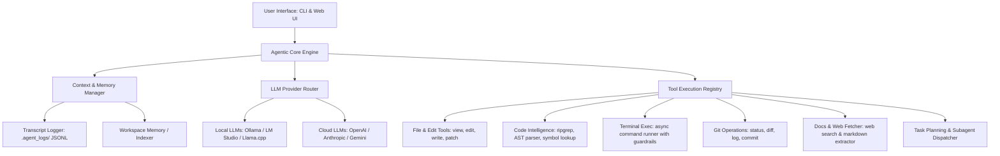

# Local Coding Agent Architecture & Design Specification

## 1. Overview
The **Local Coding Agent** is an autonomous, agentic coding assistant designed to run locally or connect to cloud/local LLMs (Ollama, LM Studio, OpenAI, Anthropic, Gemini). It features a full tool suite (file system, code search, terminal runner, git integration, subagents), robust state/context management, and both a CLI interface and Web UI.

---

## 2. System Architecture



---

## 3. Core Components & Stack

### Language & Technology Choice
- **Core Engine & CLI**: Python 3.11+ (Asyncio, Pydantic v2, Rich / Typer)
- **Web UI (Optional/Embedded)**: FastAPI + WebSocket backend with lightweight React/Vite front-end
- **Code Search & AST**: `ripgrep` / Python `ast` / `tree-sitter` bindings
- **Local Model Support**: Native REST integrations for Ollama API (`http://localhost:11434`), LM Studio, and OpenAI-compatible endpoints.

---

## 4. Module Breakdown

### Module 1: `agent_core` (Execution Loop & Context Engine)
- **`AgentEngine`**: Implements the main ReAct (Reason -> Plan -> Act -> Observe) loop.
- **`ContextManager`**: Manages sliding window context, system prompt injection, user settings, and automatic truncation/summarization when context limit is approached.
- **`TranscriptLogger`**: Writes structured JSONL session logs for debugging and replay.

### Module 2: `llm_router` (Multi-Provider LLM Integration)
- Unified `BaseLLMProvider` interface handling streaming responses and function/tool calling.
- **Providers**:
  - `OllamaProvider`: Local execution with support for models like `llama3.1`, `qwen2.5-coder`, `deepseek-coder`.
  - `OpenAIProvider` / `AnthropicProvider` / `GeminiProvider`.
- **Tool Parser**: Fallback JSON/Markdown schema parsing for local models that don't natively support structured function call APIs.

### Module 3: `tool_registry` (The "Fully Stacked" Tool Suite)
1. **File Operations**:
   - `read_file`: Reads line ranges or full content.
   - `write_file`: Safely creates/overwrites files.
   - `edit_file_exact`: Smart line-based exact pattern replacement.
   - `apply_diff`: Unified patch/diff application tool.
2. **Codebase Search & Navigation**:
   - `grep_search`: Fast pattern searching across files using ripgrep.
   - `find_files`: Glob directory scanning.
   - `ast_symbols`: Extracts class/function definitions and signatures.
3. **Terminal Runner**:
   - `run_shell`: Executes commands asynchronously with strict security filters (e.g. blocking rm -rf /) and timeout limits.
4. **Git Integration**:
   - `git_status`, `git_diff`, `git_commit_helper`.
5. **Task & Subagent Manager**:
   - `task_planner`: Breaks down user instructions into subtasks, tracks completion status.

### Module 4: `interfaces` (CLI & Web UI)
- **CLI (`rich` & `prompt_toolkit`)**: Interactive shell with auto-completion, syntax-highlighted code output, real-time tool logs, and inline diff viewing.
- **Web Interface (`FastAPI`)**: Modern dashboard showing active conversation, task progress, code diff preview, and tool execution history.

---

## 5. Directory Structure to Implement

```
c:/Work/pixelguy/agents/coding agent/
├── SPEC.md
├── ARCHITECTURE_PLAN.md
├── pyproject.toml
├── requirements.txt
├── agent/
│   ├── __init__.py
│   ├── main.py                     # CLI Entry point
│   ├── config.py                   # Configuration & Settings
│   ├── core/
│   │   ├── engine.py               # Main Agent Loop & Decision Engine
│   │   ├── context.py              # Context & Conversation History Manager
│   │   └── logger.py               # JSONL Transcript & Session Logging
│   ├── llm/
│   │   ├── base.py                 # Abstract Provider Interface
│   │   ├── ollama.py               # Local Ollama client
│   │   ├── openai_compatible.py    # OpenAI / Cloud LLM client
│   │   └── parser.py               # Tool Call parser & fallback extractor
│   ├── tools/
│   │   ├── base.py                 # Tool decorator & Registry base
│   │   ├── filesystem.py           # File read/write/edit/patch tools
│   │   ├── search.py               # Grep, glob & AST code search tools
│   │   ├── terminal.py             # Subprocess execution tools
│   │   ├── git.py                  # Git status/diff tools
│   │   └── task_planner.py         # Subtask tracker & planner tool
│   └── ui/
│       ├── cli.py                  # Rich Terminal Interface
│       └── server.py               # FastAPI Web UI server & WebSockets
└── tests/
    └── test_tools.py               # Unit tests for tools
```

---

## 6. Implementation Plan & Rules Compliance
1. **Phase 1: Architecture Review & Plan Acceptance** (Current step)
2. **Phase 2: Core Foundation & Configuration** (`pyproject.toml`, `requirements.txt`, `config.py`, `tools/base.py`)
3. **Phase 3: Tool Suite Implementation** (`filesystem.py`, `search.py`, `terminal.py`, `git.py`, `task_planner.py`)
4. **Phase 4: LLM Router & Parsers** (`base.py`, `ollama.py`, `openai_compatible.py`, `parser.py`)
5. **Phase 5: Agent Core Engine & Context Manager** (`engine.py`, `context.py`, `logger.py`)
6. **Phase 6: CLI & Web UI Interfaces** (`cli.py`, `server.py`, `main.py`)
